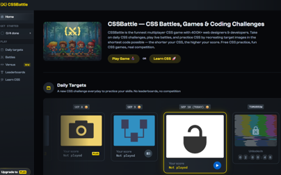
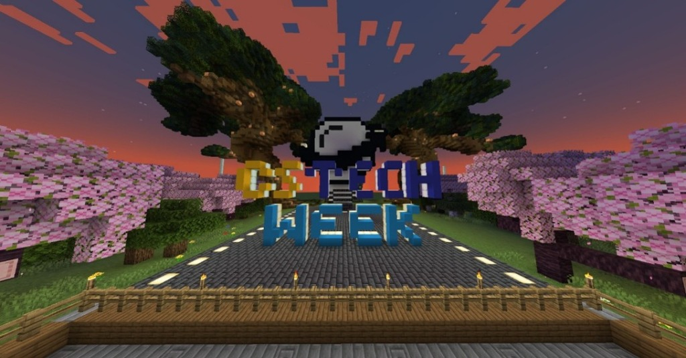
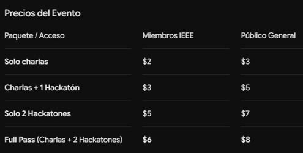
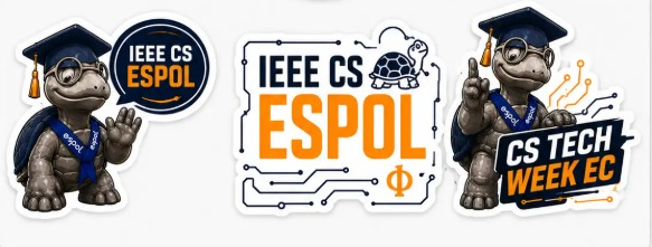
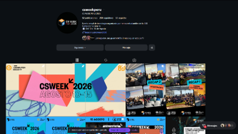

# Planificación y Propuesta del Evento:
# CS TECH WEEK (1ra Edición)

El CS TECH WEEK es un evento virtual enfocado en temas de interés informático, computacional, investigación e ingeniería. Tomando como referente de éxito el CS WEEK de Perú, esta primera edición tiene como objetivo principal consolidarse como un espacio 100% virtual, accesible e interesante para todo público.

## 1. Información General del Evento

- **Modalidad:** Virtual.
- **Duración:** 1 semana (Del 28 de septiembre al 4 de octubre).
- **Público Objetivo:** Estudiantes, profesionales y público general (abierto tanto para miembros IEEE como para público no IEEE).
- **Universidades Organizadoras:** Capítulos de IEEE Computer Society de UIDE, UPS CUENCA, UTN, YACHAY, UPEC, EPN, ESPOCH, ESPOL, USFQ, UCACUE.

## 2. Estructura y Cronograma

El evento está dividido en dos fases principales para abarcar tanto el aprendizaje teórico como la aplicación práctica de habilidades técnicas:

| Fase del Evento | Fechas | Actividades Principales |
|---|---|---|
| Semana Académica (Charlas) | 28 de septiembre al 3 de octubre (Primeros 6 días) de 5 de la tarde a 9 de la noche (17:00 a 21:00) | Conferencias virtuales dictadas por ponentes invitados (estudiantes destacados y profesionales de la industria). |
| Fin de Semana Competitivo | 3 y 4 de octubre (Fin de semana) | Desarrollo de los concursos interactivos: Mini Hackathon de CSS y Concurso de Minecraft. |

## 3. Componentes del Evento

### 3.1. Charlas y Ponencias

La agenda académica contará con invitados de alto nivel para compartir sus conocimientos y experiencias con los asistentes. Los ponentes estarán divididos en dos categorías:

- **Estudiantes:** Jóvenes universitarios con un dominio sobresaliente en temas específicos.
- **Profesionales:** Expertos de la industria que aportarán su visión, experiencia laboral e investigativa.

### 3.2. Concursos Estudiantiles

Durante el fin de semana de cierre, se llevarán a cabo dos actividades competitivas diseñadas para medir la habilidad técnica y fomentar la creatividad:

1. **Mini Hackathon de Lenguaje CSS:** Retos de diseño, maquetación y desarrollo Frontend. Auspiciado por CSS BATTLE https://cssbattle.dev

   
   *Captura de pantalla de la plataforma CSSBattle, mostrando su interfaz y desafíos de programación/diseño CSS.*

2. **Concurso de Minecraft:** Competencia de construcción, creatividad y trabajo en equipo dentro de un servidor dedicado del juego.

   
   *Captura de una construcción dentro del servidor de Minecraft del evento, con el texto/logo de CS TECH WEEK visible en la escena.*

## 4. Financiamiento y Auspicios

### 4.1. Call for Sponsors

Se ha ejecutado una convocatoria para auspiciantes con una excelente recepción. Las empresas interesadas están colaborando a través de:

- **Aportes económicos directos para cubrir los premios de los concursos.**
- **Emisión de "cheques virtuales" como premios para los ganadores.**
- **Colaboración mutua mediante difusión de sus marcas y espacios para ponencias durante el evento.**

### 4.2. Venta de Entradas (Combos)

El acceso al evento tendrá un costo manejado a través de "Combos de Entrada". La adquisición de esta entrada garantizará a los participantes:

- **Acceso a todas las charlas y conferencias magistrales.**
- **Derecho de inscripción y participación en la Mini Hackathon y el concurso de Minecraft.**
- **Certificación oficial por las horas de asistencia y participación.**

| Paquete / Acceso | Miembros IEEE | Público General |
|---|---|---|
| **Solo charlas** | $2 | $3 |
| **Charlas + 1 Hackatón** | $3 | $5 |
| **Solo 2 Hackatones** | $5 | $7 |
| **Full Pass (Charlas + 2 Hackatones)** | $6 | $8 |

*Tabla gráfica con los precios del evento, diferenciando los paquetes de acceso para miembros IEEE y público general.*

## 5. Gestión Transparente y Logística de Recompensas

El manejo financiero del evento se realizará bajo los más altos estándares de transparencia. Todos los ingresos serán evaluados en conjunto por los presidentes de capítulo de las universidades participantes.

Los fondos recaudados (entradas y patrocinios) se destinarán a:

- **Premios económicos y virtuales para los ganadores de los concursos.**
- **Producción de Merchandising físico (ej. stickers y recuerdos del CS TECH WEEK).** Estos detalles se distribuirán a los CHAIR de Capítulos Técnicos o Rama General mediante "puntos de entrega" en cada universidad organizadora (replicando iniciativas como la entrega de stickers de ESPOL).

*Imagen de merchandising y material gráfico de IEEE CS ESPOL relacionado con CS TECH WEEK, incluyendo stickers de la mascota tortuga y logotipos oficiales.*

## 6. Requerimientos de Certificación

Para avalar la participación de los inscritos, se emitirán certificados digitales. Nota de solicitud: Se requiere apoyo de Computer Society Ecuador para gestionar la firma virtual de estos certificados antes de su envío masivo a los asistentes registrados hecho por nosotros como estudiantes.

## 7. Estrategia de Difusión y Publicidad

La promoción del CS TECH WEEK se está ejecutando activamente mediante canales digitales de alto alcance en las comunidades estudiantiles:

- **Instagram Oficial:** Cuenta dedicada del evento ([@ecu.cs.week.2026](https://www.instagram.com/ecu.cs.week.2026)).
- **Comunidades Universitarias:** Difusión a través de los canales oficiales de WhatsApp de las universidades participantes.

## 8. Anexos

### CS WEEK PERU

https://www.instagram.com/csweekperu?utm_source=ig_web_button_share_sheet&stkn=ZDNlZDc0MzIxNw==

*Captura de la cuenta de Instagram de CS WEEK Perú, utilizada como referente del evento.*

### CS TECH WEEK 2026

https://www.instagram.com/ecu.cs.week.2026?utm_source=ig_web_button_share_sheet&stkn=ZDNlZDc0MzIxNw==

*Cuenta oficial de Instagram de CS TECH WEEK 2026, canal principal de difusión y actualizaciones del evento.*
